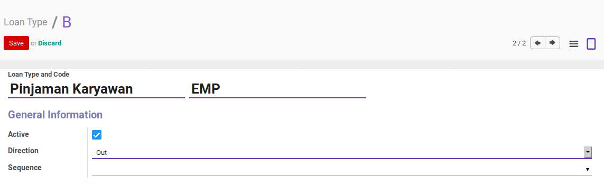
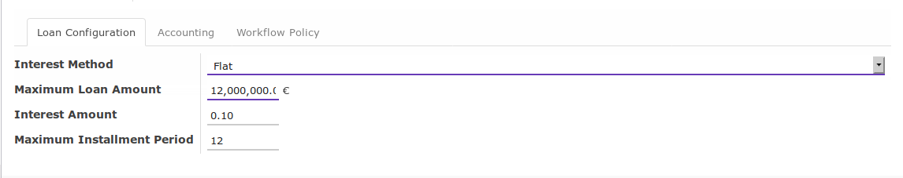
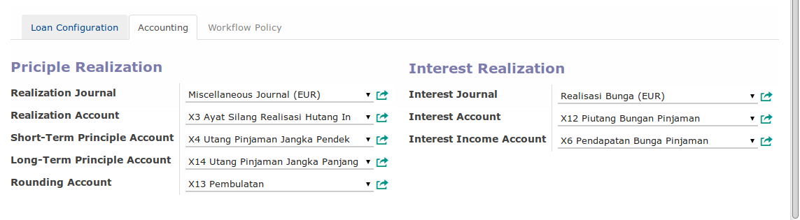
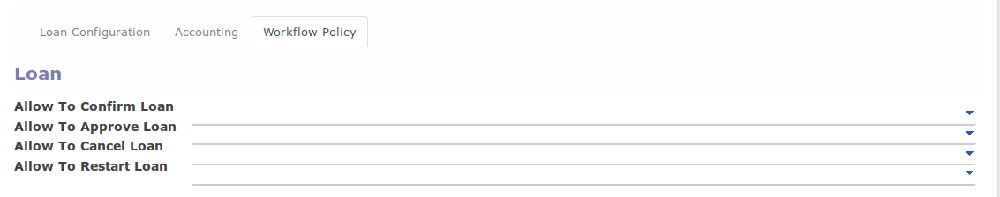

# Loan Type

## A. PENJELASAN ISIAN

### A.1. BAGIAN HEADER

#### <a name="field-name">Loan Type</a>

Nama tipe pinjaman. Wajib diisi.

#### <a name="field-code">Loan Type Code</a>

Kode tipe pinjaman. Wajib Diisi.

#### <a name="field-active">Active</a>

Aktifkan jika data tipe pinjaman masih aktif digunakan. Non aktifkan jika tipe pinjaman
sudah tidak digunakan lagi.

#### <a name="field-direction">Direction</a>

Pilihan yang dimungkinkan:

* **In**: Pinjaman dari pihak lain kepada perusahaan
* **Out**: Pinjaman dari perusahaan kepada pihak lain

#### <a name="field-sequence">Sequence</a>

Sequence yang digunakan untuk penomeran pinjaman. Tidak wajib diisi.

### A.2. TAB LOAN

#### <a name="field-interest-method">Interest Method</a>

Metode perhitungan bunga pinjaman. Wajib diisi. Pilihan yang dimungkinkan:

* **Flat**
* **Anuity**
* **Effective**

#### <a name="field-maximum-loan-amount">Maximum Loan Amount</a>

Nilai maksimum pinjaman. Wajib diisi.

#### <a name="field-interest-amount">Intereset Amount</a>

Bunga pinjaman (p.a) dalam persen. Wajib diisi.

#### <a name="field-maximum-installment-amount">Maximum Installment Amount</a>

Maksimum tenor pinjaman dalam bulan. Wajib diisi.

### A.3. TAB ACCOUNTING

#### <a name="field-realization-journal">Realization Journal</a>

Buku jurnal yang akan digunakan untuk mencatat penjurnalan realiasi pinjaman. Tidak wajib diisi.

#### <a name="field-realization-account">Realization Account</a>

Akun yang akan digunakan pada penjunalan realisasi pinjaman. Pada **loan in** akun ini akan didebit sedangkan
pada **loan out** akun ini akan dikredit. Akun ini akan didebit/dikredit sebesar **Loan Amount***. Tidak wajib diisi.

#### <a name="field-short-term-principle-account">Short-Term Principle Account</a>

Akun yang akan digunakan pada penjunalan realisasi pinjaman. Akan terbentuk n x journal item pada penjurnalan realisasi pinjaman. n sama dengan jumlah payment schedule yang jatuh tempo setahun semenjak tanggal realisasi. Pada **loan in** akun ini akan dikredit sedangkan pada **loan out** akun ini akan didebit. Akun ini akan didebit/dikredit sebesar **Loan Amount***. Tidak wajib diisi.

#### <a name="field-long-term-principle-account">Long-Term Principle Account</a>

Akun yang akan digunakan pada penjunalan realisasi pinjaman. Akan terbentuk n x journal item pada penjurnalan realisasi pinjaman. n sama dengan jumlah payment schedule yang jatuh tempo lebih dari setahun semenjak tanggal realisasi. Pada **loan in** akun ini akan dikredit sedangkan pada **loan out** akun ini akan didebit. Akun ini akan didebit/dikredit sebesar **Loan Amount***. Tidak wajib diisi.

#### <a name="field-rounding-principle-account">Rounding Principle Account</a>

Akun yng akan digunakan untuk pembulatan. Tidak wajib diisi.

#### <a name="field-interest-journal">Interest Journal</a>

Buku jurnal yang digunakan untuk mencatat penjurnalan realisasi bunga pinjaman. Tidak wajib diisi.

#### <a name="field-interest-account">Interest Account</a>

Akun yang akan digunakan pada penjurnalan realisasi bunga pinjaman. Akun ini akan dikredit pada **loan in** atau akan didebit pada **loan out**. Akun ini akan didebit/dikredit sejumlah interest amount payment schedule. Tidak wajib diisi.

#### <a name="field-interest-income-account">Interest Income Account</a>

Akun yang akan digunakan pada penjurnalan realisasi bunga pinjaman. Akun ini akan didebit pada **loan in** atau akan dikredit pada **loan out**. Akun ini akan didebit/dikredit sejumlah interest amount payment schedule. Tidak wajib diisi.

### A.4. TAB WORKFLOW

#### <a name="field-allow-confirm">Allow To Confirm Loan</a>

Group-group yang usernya diperbolehkan untuk mengkonfirmasi pinjaman. Jika dikosongkan maka tiap user yang dapat membuka data loan in/out dapat mengkonfirmasi data loan in/out. Tidak wajib diisi.

#### <a name="field-allow-approve">Allow To Approve Loan</a>

Group-group yang usernya diperbolehkan untuk menyetujui pinjaman. Jika dikosongkan maka tiap user yang dapat membuka data loan in/out dapat menyetujui data loan in/out. Tidak wajib diisi.

#### <a name="field-allow-cancel">Allow To Cancel Loan</a>

Group-group yang usernya diperbolehkan untuk membatalkan pinjaman. Jika dikosongkan maka tiap user yang dapat membuka data loan in/out dapat membatalkan data loan in/out. Tidak wajib diisi.

#### <a name="field-allow-restart">Allow To Restart Loan</a>

Group-group yang usernya diperbolehkan untuk merestart pinjaman. Jika dikosongkan maka tiap user yang dapat membuka data loan in/out dapat merestart data loan in/out. Tidak wajib diisi.
