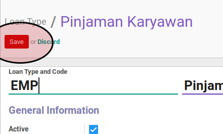

# Sequence

## A. PETUNJUK KERJA

1. Buka menu **Loan & Saving -> Configuration -> Loan Type**
2. Buka data loan type yang akan dikonfigurasi
3. Klik tombol **Edit** pada bagian atas-kiri form
4. Pilih **[Sequence](../loan-type.md#field-sequence)**
5. Klik tombol **Save** pada bagian atas-kiri form

