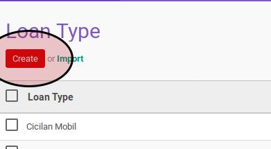
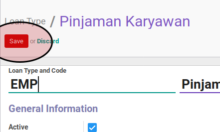

# Pembuatan

## A. PETUNJUK KERJA

1. Buka menu **Loan & Saving -> Configuration -> Loan Type**
2. Klik tombol **Create** pada bagian atas-kiri

3. Isi **[Loan Type Code](../loan-type.md#field-code)**
4. Isi **[Loan Type Name](../loan-type.md#field-name)**
5. Pilih **[Direction](../loan-type.md#field-direction)**
6. Buka tab **Loan Configuration**
7. Isi **[Interst Method](../loan-type.md#field-interest-method)**
8. Isi **[Maximum Loan Amount](../loan-type.md#field-maximum-loan-amount)**
9. Isi **[Interest Amount](../loan-type.md#field-interest-amount)**
10. Isi **[Maximum Installment Period](../loan-type.md#field-maximum-installment-period)**
11. Klik tombol **Save** pada bagian atas-kiri form

