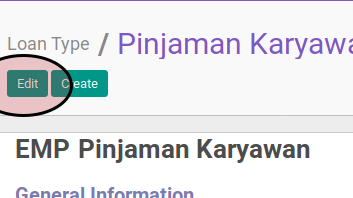

# Workflow

## A. PETUNJUK KERJA

1. Buka menu **Loan & Saving -> Configuration -> Loan Type**
2. Buka data loan type yang akan dikonfigurasi
3. Klik tombol **Edit** pada bagian atas-kiri form

4. Buka tab **Workflow**
5. Pada bagian **Loan**
6. Pilih **[Allow to Confirm](../loan-type.md#field-allow-confirm)**. Tidak harus diisi.
7. Pilih **[Allow to Approve](../loan-type.md#field-allow-approve)**. Tidak harus diisi.
8. Pilih **[Allow to Cancel](../loan-type.md#field-allow-cancel)**. Tidak harus diisi.
9. Pilih **[Allow to Restart](../loan-type.md#field-allow-restart)**. Tidak harus diisi.
10. Klik tombol **Save** pada bagian atas-kiri form

