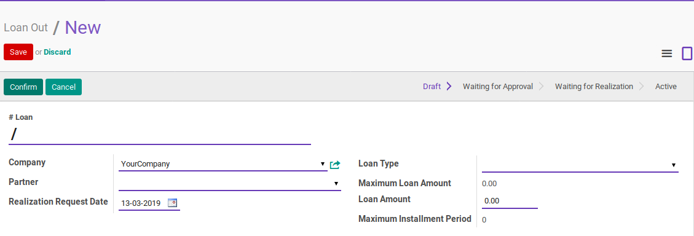
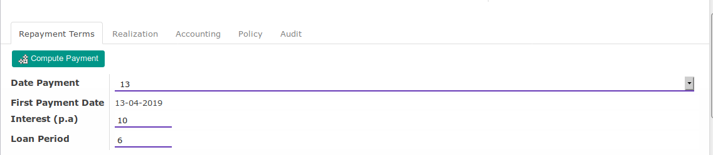
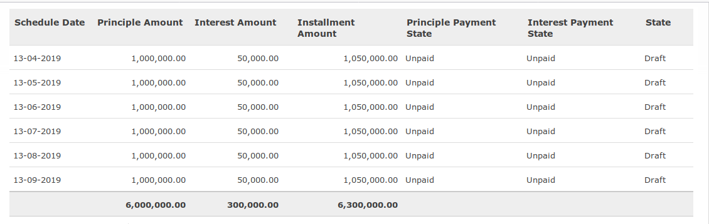
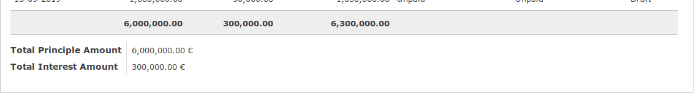

# Loan Out

*Loan Out* adalah fitur yang digunakan untuk mencatat pemberian pinjaman ke pihak lain.

Loan Out dapat diakses melalui menu **Loan & Saving -> Loan -> Loan Out**

## A. Penjelasan Isian

### A.1 Bagian Utama

#### # Loan

Nomor dokumen *loan out*. Biarkan terisi dengan / apabila nomor dokumen ingin diisi
dengan penomeran otomatis. Ubah dengan nomor yang dikehendaki jika tidak menginginkan
penomeran oromatis

> Wajib diisi

#### Company

Pemilik dokumen *loan out*. Hanya terlihat dalam skenario *multi-company*

> Wajib diisi

#### Realization Request Date

Tanggal yang diinginkan oleh peminjamn agar pinjaman direalisasikan/dicairkan.

Wajib diisi

#### Loan Type

Jenis pinjaman

Wajib diisi

#### Maximum Loan Amount

Batas pinjaman maksimal yang diizinkan. Jumlah ini akan disesuaikan oleh **Loan Type**
yang dipilih

Tidak dapat diubah/hanya informasi

#### Loan Amount

Jumlah pinjaman yang diinginkan. Tidak boleh lebih dari **Maximum Loan Amount**

Wajib diisi

#### Maximum Installment Period

Tenor pinjaman maksimal yang diizinkan. Jumlah ini akan disesuaikan oleh **Loan Type**

### A.2 Repayment Term

#### Date Payment

Tanggal pembayaran yang dikehendaki. Cicilan pembayaran akan selalu jatuh tempo
pada tanggal ini tiap bulannya.

Wajib diisi

#### First Payment Date

Tanggal cicilan ke-1

Tidak dapat diubah/hanya informasi

#### Interest (p.a)

Bunga pinjaman pertahun dalam persen

Wajib diisi

#### Loan Period

Tenor pinjaman

Wajib diisi

### A.3 Payment Schedule

#### Schedule Date

Tanggal jatuh tempo cicilan

#### Priciple Amount

Jumlah pokok pinjaman yang harus dibayar

#### Interest Amount

Jumlah bunga pinjaman yang harus dibayar

#### Installment Amount

Jumlah cicilan (pokok pinjaman + bunga pinjaman)

#### Principle Payment State

Status pembayaran pokok pinjaman. Status yang dimungkinkan adalah:

* **Unpaid**. Belum dibayar sama sekali
* **Partial Paid**. Sudah dibayar sebagian.
* **Paid**. Sudah dibayar

#### Interest Payment State

Status pembayaran bunga pinjaman. Status yang dimungkinkan adalah:

* **Unpaid**. Belum dibayar sama sekali
* **Partial Paid**. Sudah dibayar sebagian.
* **Paid**. Sudah dibayar

### A.4 Summary

#### Total Priciple Amount

Total pokok pinjaman

Tidak dapat diubah/hanya informasi

#### Total Interest Amount

Total bunga pinjaman

Tidak dapat diubah/hanya informasi
