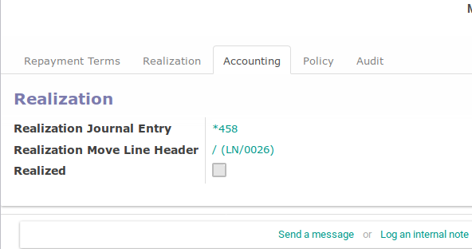

# Loan Out

*Loan Out* adalah fitur yang digunakan untuk mencatat pemberian pinjaman ke pihak lain.

Loan Out dapat diakses melalui menu **Loan & Saving -> Loan -> Loan Out**

## A. Penjelasan Isian

### A.1 Bagian Utama

#### <a name="field-name"># Loan</a>

Nomor dokumen *loan out*. Biarkan terisi dengan / apabila nomor dokumen ingin diisi
dengan penomeran otomatis. Ubah dengan nomor yang dikehendaki jika tidak menginginkan
penomeran oromatis

Wajib diisi

#### <a name="field-company">Company</a>

Pemilik dokumen *loan out*. Hanya terlihat dalam skenario *multi-company*

Wajib diisi

#### <a name="field-partner">Partner</a>

Debitur.

Wajib diisi

#### <a name="field-realization-request-date">Realization Request Date</a>

Tanggal yang diinginkan oleh peminjamn agar pinjaman direalisasikan/dicairkan.

Wajib diisi

#### <a name="field-type">Loan Type</a>

Jenis pinjaman

Wajib diisi

#### <a name="field-maximum-loan-amount">Maximum Loan Amount</a>

Batas pinjaman maksimal yang diizinkan. Jumlah ini akan disesuaikan oleh **Loan Type**
yang dipilih

Tidak dapat diubah/hanya informasi

#### <a name="field-loan-amount">Loan Amount</a>

Jumlah pinjaman yang diinginkan. Tidak boleh lebih dari **Maximum Loan Amount**

Wajib diisi

#### <a name="field-maximum-installment-period">Maximum Installment Period</a>

Tenor pinjaman maksimal yang diizinkan. Jumlah ini akan disesuaikan oleh **Loan Type**

### A.2 Repayment Term

#### <a name="field-date-payment">Date Payment</a>

Tanggal pembayaran yang dikehendaki. Cicilan pembayaran akan selalu jatuh tempo
pada tanggal ini tiap bulannya.

Wajib diisi

#### <a name="field-first-payment-date">First Payment Date</a>

Tanggal cicilan ke-1

Tidak dapat diubah/hanya informasi

#### <a name="field-interest">Interest (p.a)</a>

Bunga pinjaman pertahun dalam persen

Wajib diisi

#### <a name="field-name">Loan Period</a>

Tenor pinjaman

Wajib diisi

### A.3 Payment Schedule

#### <a name="field-schedule-date">Schedule Date</a>

Tanggal jatuh tempo cicilan

Tidak dapat diubah/hanya informasi

#### <a name="field-principle-amount">Priciple Amount</a>

Jumlah pokok pinjaman yang harus dibayar

Tidak dapat diubah/hanya informasi

#### <a name="field-interest-amount">Interest Amount</a>

Jumlah bunga pinjaman yang harus dibayar

Tidak dapat diubah/hanya informasi

#### <a name="field-installment-amount">Installment Amount</a>

Jumlah cicilan (pokok pinjaman + bunga pinjaman)

Tidak dapat diubah/hanya informasi

#### <a name="field-principle-payment-state">Principle Payment State</a>

Status pembayaran pokok pinjaman. Status yang dimungkinkan adalah:

* **Unpaid**. Belum dibayar sama sekali
* **Partial Paid**. Sudah dibayar sebagian.
* **Paid**. Sudah dibayar

Tidak dapat diubah/hanya informasi

#### <a name="field-interest-payment-state">Interest Payment State</a>

Status pembayaran bunga pinjaman. Status yang dimungkinkan adalah:

* **Unpaid**. Belum dibayar sama sekali
* **Partial Paid**. Sudah dibayar sebagian.
* **Paid**. Sudah dibayar

Tidak dapat diubah/hanya informasi

### A.4 Summary

#### <a name="field-total-principle-amount">Total Priciple Amount</a>

Total pokok pinjaman

Tidak dapat diubah/hanya informasi

#### <a name="field-total-interest-amount">Total Interest Amount</a>

Total bunga pinjaman

Tidak dapat diubah/hanya informasi

### A.5 Accounting

#### <a name="field-realization-journal-entry">Realization Journal Entry</a>

Penjurnalan (*journal entry*) realizasi pinjaman.

Tidak dapat diubah/hanya informasi

#### <a name="field-realization-move-line-header">Realization Move Line Header</a>

Baris penjurnalan (*journal item*) realizasi pinjaman. Journal item ini nantinya harus direkonsiliasi
agar pinjaman dapat aktif.

Tidak dapat diubah/hanya informasi

#### <a name="field-realized">Realized</a>

Aktif jika pinjaman sudah direalisasi. Non-aktif jika pinjaman masih menunggu realisasi.

Tidak dapat diubah/hanya informasi
