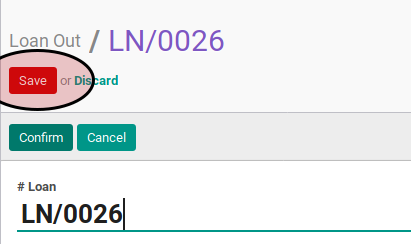
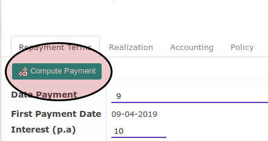

# Membuat Loan Out

## A. PETUNJUK KERJA

Berikut adalah langkah-langkah untuk mengkonfirmasi *loan out*:

1. Buka menu **loan out**
2. Klik tombol **Create** pada bagian atas-kiri form
3. Ubah **[# Loan](./loan-out.md#field-name)** jika diinginkan
4. Pilih **[Company](./loan-out.md#field-company)**. Harus diisi.
5. Pilih **[Partner](./loan-out.md#field-partner)**. Harus diisi.
6. Isi **[Realization Request Date](./loan-out.md#field-realization-request-date)**. Harus diisi.
7. Pilih **[Loan Type](./loan-out.md#field-type)**. Harus diisi.
8. Isi **[Loan Amount](./loan-out.md#field-loan-amount)**. Harus diisi.
9. Pilih **[Date Payment](./loan-out.md#field-date-payment)**. Harus diisi.
10. Isi **[Interest (p.a)](./loan-out.md#field-interest)**. Harus diisi.
11. Isi **[Loan Period](./loan-out.md#field-loan-period)**. Harus diisi.
12. Buka tab **Realization**
13. Isi **[Realizasion Date](./loan-out.md#field-realization-date)**. Opsional.
14. Klik tombol **Save** pada bagian atas-kiri form.

15. Buka tab **Repayment Term**
16. Klik tombol **Compute Payment**.

