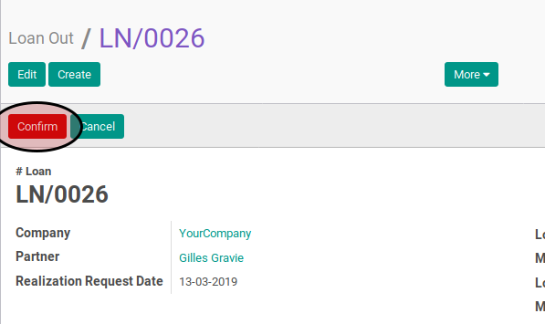
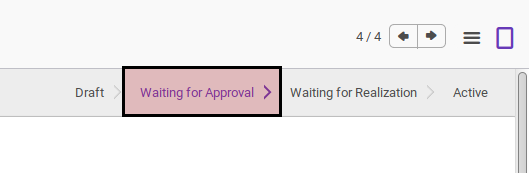

# Mengkonfirmasi Loan Out

## Petunjuk Kerja

Berikut adalah langkah-langkah untuk mengkonfirmasi *loan out*:

1. Buka data *loan out* yang akan dikonfirmasi
2. Klik tombol **Confirm** pada bagian atas-kanan form

## Respons Yang Diharapkan

Setelah *loan out* dikonfirmasi maka:

1. Status *loan out* akan berubah menjadi **Waiting for Approval**

2. Beberapa field sudah tidak dapat diedit

#### PERHATIAN

Apabila Anda tidak memiliki hak akses untuk mengkonfirmasi *loan out* maka tombol
**Confirm** tidak akan terlihat. Hubungi administrator Odoo Anda untuk meminta
akses.
