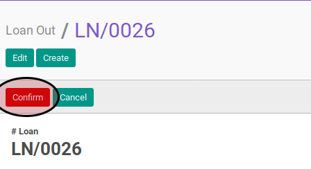
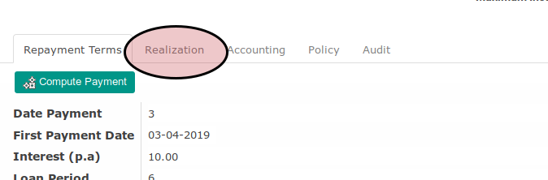
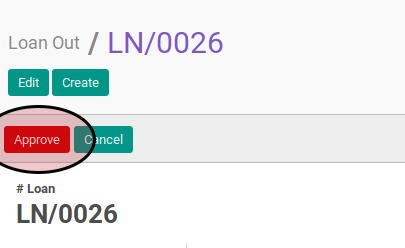
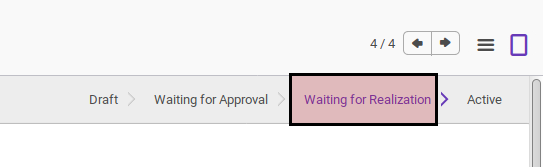

# Menyetujui Loan Out

## Petunjuk Kerja

Berikut adalah langkah-langkah untuk menyetujui *loan out*:

1. Buka data *loan out* yang akan dikonfirmasi
2. Klik tombol **Edit** pada bagian atas-kanan form

3. Buka tab **Realization**

4. Ubah **Realization Date** sesuai dengan rencana realisasi *loan out*
5. Klik tombol **Save** pada bagian atas-kanan form

6. Klik tombol **Approve** pada bagian atas-kanan form

## Respons Yang Diharapkan

Setelah *loan out* dikonfirmasi maka:

1. Status *loan out* akan berubah menjadi **Waiting for Realization**

2. Beberapa field sudah tidak dapat diedit

#### PERHATIAN

Apabila Anda tidak memiliki hak akses untuk menyetujui *loan out* maka tombol
**Approve** tidak akan terlihat. Hubungi administrator Odoo Anda untuk meminta
akses.
